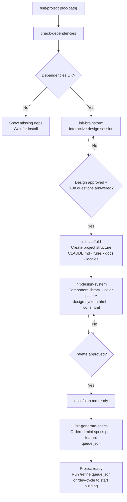
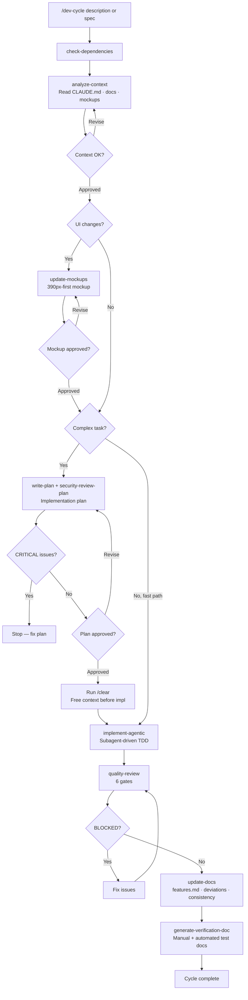
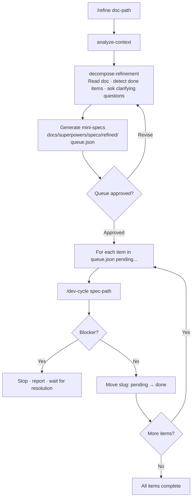
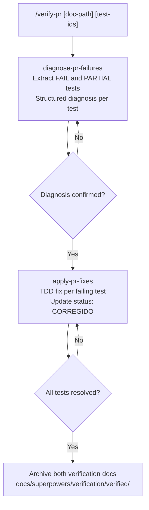

# claude-toolbelt

Personal toolbelt for Claude Code: a reusable development workflow plugin, shell configuration, and a status line script.

The centrepiece is **dev-workflow** — a Claude Code plugin that turns Claude into a structured development partner. It provides slash commands for the full lifecycle of a software project: from blank-slate brainstorming to feature implementation, quality gates, security review, and PR verification.

---

## Contents

- [`plugin/`](#dev-workflow-plugin) — the dev-workflow Claude Code plugin
- [`shell/`](#shell-configuration) — Zsh configuration and Starship prompt
- [`statusline/`](#status-line) — Claude Code status line script

---

## dev-workflow plugin

### What it is

A Claude Code plugin that codifies a complete software development workflow as slash commands, focused skills, and canonical rules. Install it once, use it across every project.

**Philosophy:** Claude should be a disciplined collaborator, not a free-form assistant. Every command follows an explicit sequence with gates — checkpoints where the developer approves work before Claude proceeds. No surprises, no code appearing before a plan is approved, no merges before tests pass.

### Install

```bash
claude plugin install /path/to/claude-toolbelt/plugin
```

Then install the required framework plugins (see [Dependencies](#dependencies)).

---

### Two workflows

The plugin covers two main workflows:

**Bootstrap** — start a new project from scratch with `/init-project`

**Development** — build features on an existing project with `/dev-cycle` and `/refine`

---

### Bootstrap workflow — `/init-project`

Use once when starting a new project. Guides you from idea to a fully scaffolded codebase with design system and ordered feature queue.



**What gets created:**

| Path | Contents |
|------|----------|
| `CLAUDE.md` | Project index under 100 lines — stack, rules, docs, i18n, workflow |
| `.claude/rules/` | Project-specific rules: coding, architecture, testing, UI, observability |
| `docs/plan.md` | Approved high-level design from brainstorming |
| `docs/design-system.html` | Standalone visual design system with component previews |
| `docs/icons.html` | Searchable icon catalog with copy-ready usage snippets |
| `locales/<locale>/` | Translation file stubs per feature area |
| `docs/superpowers/specs/refined/` | One mini-spec per feature, ordered by implementation dependency |
| `IMPLEMENTATION.md` | Sprint tracker table |

---

### Development workflow — `/dev-cycle`

The core loop. Run it for every feature or bug fix — whether from a plain description or a spec file generated by `/refine`.



**Quality review gates:**

| Gate | What it checks |
|------|---------------|
| 1 — Architecture | Layer boundaries, forbidden cross-layer imports |
| 2 — Error & observability | Unhandled errors, missing Sentry/logging calls |
| 3 — Tracing | Span naming, required attributes, approved op categories |
| 4 — React best practices | Component patterns, hook rules, performance anti-patterns |
| 5 — Security | OWASP top 10, injection vectors, auth/authz gaps |
| 6 — i18n compliance | Hardcoded strings (HIGH), missing keys (HIGH), inline plurals (MEDIUM) |

CRITICAL issues from Gate 5 or HIGH violations from Gate 6 block the cycle.

---

### Refinement workflow — `/refine`

Turns a product brief, change document, or feature list into an ordered queue of mini-specs, then runs `/dev-cycle` for each item.



---

### PR verification workflow — `/verify-pr`

Diagnoses failures in a verification document and applies fixes.



---

### All commands

| Command | Purpose |
|---------|---------|
| `/init-project [doc-path]` | Bootstrap a new project end-to-end |
| `/dev-cycle <description\|spec>` | Full development cycle for a feature or fix |
| `/refine <doc-path>` | Decompose a brief into ordered specs and run dev-cycles |
| `/verify-pr [doc-path] [test-ids]` | Diagnose and fix verification failures |
| `/security-review plan <path>` | Security review a plan before implementation |
| `/security-review code` | Security review `git diff main` after implementation |
| `/generate-verification` | Generate manual + automated verification docs |
| `/init-design-system` | Generate or regenerate the project design system |
| `/update-icons` | Add new icons from the current branch to `docs/icons.html` |
| `/ui-contrast` | Audit UI components against `.claude/rules/ui.md` for WCAG compliance |

---

### Skills

Skills are focused units invoked by commands. They can also be invoked directly from Claude.

**Bootstrap**

| Skill | What it does |
|-------|-------------|
| `init-brainstorm` | Interactive design session wrapping `superpowers:brainstorming`; asks i18n questions at the end |
| `init-scaffold` | Creates full project structure, CLAUDE.md, rules files, docs stubs, locales/ |
| `init-generate-specs` | Orders features by implementation dependency, generates mini-specs + queue.json |
| `init-design-system` | Library + palette selection, generates design-system.html, icons.html, .claude/rules/ui.md |
| `update-icons` | Scans branch for new icon imports, adds uncatalogued icons to icons.html |

**Development cycle**

| Skill | What it does |
|-------|-------------|
| `check-dependencies` | Verifies required plugins and MCPs are installed |
| `analyze-context` | Reads project docs to build a context summary before any work begins |
| `update-mockups` | Generates 390px-first UI mockups via `frontend-design` |
| `write-plan` | Produces a TDD implementation plan via `superpowers:writing-plans` |
| `implement-agentic` | Runs plan via `superpowers:subagent-driven-development` |
| `quality-review` | Runs 6 gates: architecture, observability, tracing, React, security, i18n |
| `update-docs` | Updates features.md, plan deviations, consistency across docs |
| `generate-verification-doc` | Produces manual and automated verification docs |

**Security**

| Skill | What it does |
|-------|-------------|
| `security-review-plan` | Reviews a plan file before implementation; CRITICAL issues block the gate |
| `security-review-code` | Reviews `git diff main`; CRITICAL issues block merge |
| `i18n-compliance` | Scans modified files for hardcoded strings, missing keys, locale misuse |

**PR verification**

| Skill | What it does |
|-------|-------------|
| `diagnose-pr-failures` | Extracts FAIL/PARTIAL tests, produces structured diagnosis |
| `apply-pr-fixes` | Applies TDD fixes per failing test, updates verification status |

**Refinement**

| Skill | What it does |
|-------|-------------|
| `decompose-refinement` | Reads a change doc, filters done items, orders work, generates mini-specs |

---

### Rules

Canonical standards Claude references throughout the workflow. Organised by topic.

**Process**

| Rule | Description |
|------|-------------|
| `git-discipline` | Commit message format, atomic commits, branch naming |
| `dev-prod-parity` | Keep development and production environments in sync |
| `tdd-cycle` | Red → Green → Refactor; tests before implementation |
| `implementation-tracking` | IMPLEMENTATION.md format and sprint tracker conventions |

**Code quality**

| Rule | Description |
|------|-------------|
| `code-quality` | Naming, file size, single responsibility, no premature abstraction |
| `database-patterns` | Query patterns, N+1 prevention, migration conventions |
| `redis-cache-pattern` | 9-step read-through cache with typed payload and graceful degradation |

**Security**

| Rule | Description |
|------|-------------|
| `security-checklist` | OWASP top 10 reference for design and implementation reviews |
| `code-quality-checklist` | Post-implementation code quality checklist |

**UI**

| Rule | Description |
|------|-------------|
| `mobile-first` | 390px-first design, breakpoint discipline |
| `skeleton-first` | Loading states before content, no layout shift |
| `fine-grained-reactivity` | Minimal re-renders, reactive primitive granularity |
| `i18n` | Mandatory internationalisation — library usage, key conventions, plural rules |

**Observability**

| Rule | Description |
|------|-------------|
| `error-observability` | Sentry/error tracker integration, context enrichment |
| `background-tasks` | Logging, retry, dead-letter conventions for async work |
| `tracing-conventions` | `"<verb> <object>"` span naming, approved op categories, required attributes |
| `honeycomb-investigation` | Structured query workflow for production investigations |

**Workflow**

| Rule | Description |
|------|-------------|
| `project-structure` | Directory layout, file naming, where docs live |
| `verification-doc-format` | Two-document verification format (manual + automated) |
| `ui-first-testing` | Visual and interaction tests before unit tests for UI work |

**Templates**

| Template | Description |
|----------|-------------|
| `architecture-layers` | Architecture layer definition template (paths, rules, forbidden patterns) |
| `ui-design-tokens` | Token reference table template (light/dark, WCAG ratios, pattern catalogue) |

---

### Dependencies

```bash
# Required framework plugins
claude plugin install superpowers
claude plugin install frontend-design
claude plugin install vercel

# Required for Honeycomb investigation rule
claude plugin install honeycomb --from honeycomb-plugins
claude mcp add honeycomb   # + set HONEYCOMB_API_KEY env var

# Optional: enables /requesting-code-review in dev-cycle
claude plugin install code-review
```

---

## Versioning and releases

Releases are managed automatically via [release-please](https://github.com/googleapis/release-please-action). Every push to `main` is analysed and, when releasable commits are found, a Release PR is opened with the updated `plugin/CHANGELOG.md` and `plugin/package.json`. Merging that PR creates the GitHub Release and the `v1.x.x` tag.

### Commit convention

Use **Conventional Commits** prefixed with a gitmoji for readability:

| Emoji | Prefix | Version bump | When to use |
|-------|--------|-------------|-------------|
| ✨ | `feat:` | minor | New command, skill, or rule |
| 🐛 | `fix:` | patch | Bug fix in existing skill or command |
| 💥 | `feat!:` | **major** | Breaking change (renamed command, changed skill interface) |
| 📝 | `docs:` | — | README, CHANGELOG, comments |
| ♻️ | `refactor:` | — | Internal restructure, no behaviour change |
| 🔧 | `chore:` | — | Config, CI, tooling |
| 🔒 | `fix(security):` | patch | Security fix |

**Examples:**

```bash
✨ feat: add init-brainstorm skill with i18n setup questions
🐛 fix: correct unclosed code fence in init-scaffold template
💥 feat!: rename quality-review Gate 5 to security-review-code
📝 docs: add workflow diagrams to README
♻️ refactor: split init-scaffold into smaller steps
```

Commits prefixed with `docs:`, `refactor:`, or `chore:` appear in the changelog but do not trigger a version bump on their own.

---

## Shell configuration

`shell/zshrc` — Zsh config with quality-of-life tooling. Symlink to `~/.zshrc`.

**Tools configured:**

| Tool | Purpose |
|------|---------|
| `zsh-autosuggestions` | Fish-style inline suggestions (accept with `→`) |
| `zsh-syntax-highlighting` | Real-time command highlighting |
| `fzf` + `fd` | Fuzzy file and directory search |
| `zoxide` | Smart `cd` with frecency — use `z` / `zi` |
| `eza` | Modern `ls` (aliased as `ls`, `ll`, `la`, `tree`) |
| `bat` | Syntax-highlighted `cat` |
| `delta` | Better git diff pager |
| `starship` | Cross-shell prompt |
| `fnm` | Node version manager |

**Git aliases:** `gcm "message"` (stage all + commit), `gpush`, `gs`, `gd`, `gds`, `gl`, `gla`

`shell/starship.toml` — Starship prompt config. Symlink to `~/.config/starship.toml`.

---

## Status line

`statusline/statusline-command.sh` — Claude Code status line script. Reads the Claude Code hook payload from stdin and outputs a formatted string showing model name, context window usage %, and time until the 5-hour rolling token reset.

```bash
# Test manually
echo '{"model":{"display_name":"Claude Sonnet"},"context_window":{"used_percentage":42}}' \
  | bash statusline/statusline-command.sh
```
